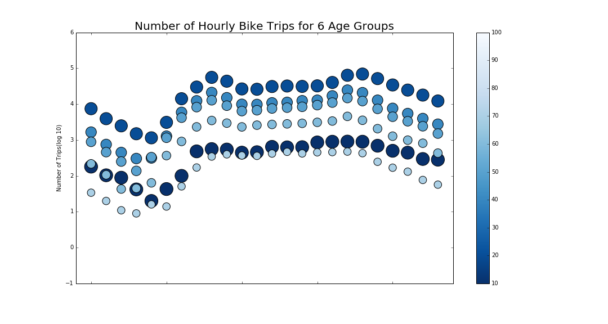

Assignment 8:

Choose to plot anything you wish, from the data we used so far. Please make it a good plot. Possibly choose data with more than 2 dimensions, so that you are challenging yourself to represent a third dimension graphically (e.g. time, distance, and gas consumed to travel would amount to 3 dimensions: if you had to plot them you could make a plot of distance v time, but you would have to come up with a graphical way to represent the gas usage: color, size, a third dimension...).

My Plot:

