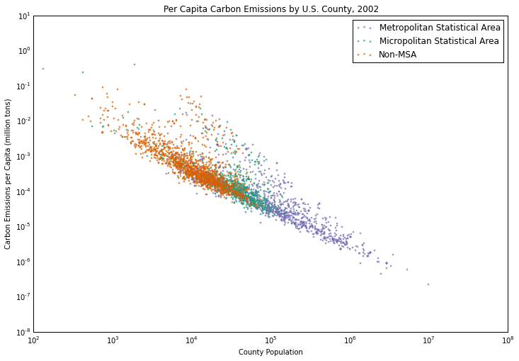

## Plot 1 from John J Hall

## Comment
1. Clarity

  I think the data of y-axis is quite confusing. I can't imagine a county with 10,000 population and 10,000 carbon emission per capita. The U.S. average carbon emission per capita in 2002 is 19.65. As I wonder the unit of y-axis is wrong.

2. Esthetics
  
  The color and clustering of metropolitan and micropolitan areas are clear.

3. Honesty
  
  As the y-axis is confusing, I think the author should check the data. 

4. Suggestion
  
  Check the carbon emission per capita data and its unit.
