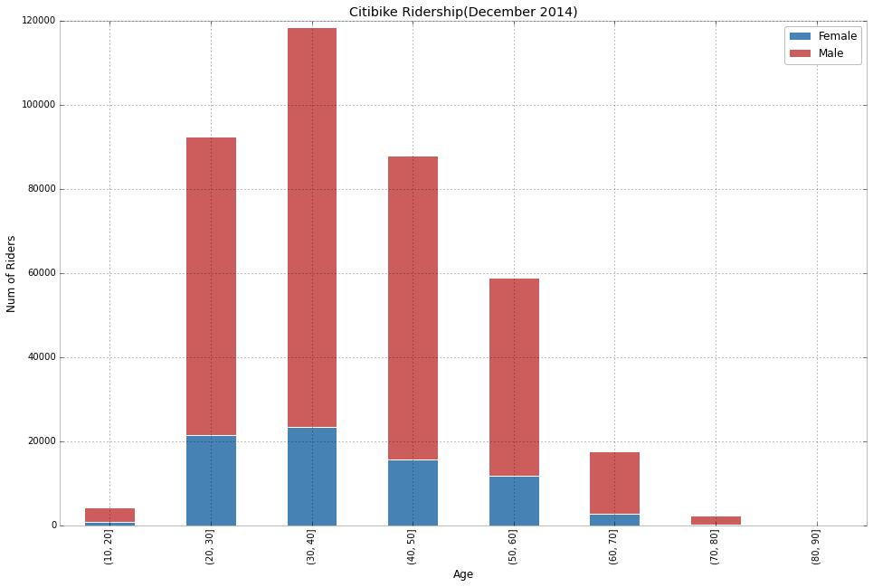

## Plot 2: Sachin Verma 

## Review
1. Clarity
The plot is quite clear. The stacked bar plot tells the number of femal/male riders in different age groups.

2. Esthetic
The colors representing males and females are good. But the title size should be larger for esthetic. In its title, ridership is a vague term, and author should make it more clear as to communicate the purpose of the plot better.

3. Honesty
I think the plot fairly represents the dataset.

4. Suggestion
Check the title of the plot.
